# 📊 Revisión Completa del Flujo de Balance - Sistema Punto de Cambio

**Fecha:** 2025-01-08  
**Versión:** 1.0  
**Estado:** ✅ Corregido y Documentado

---

## 🎯 Resumen Ejecutivo

Este documento detalla la revisión completa del flujo de datos desde las transacciones hasta el cálculo de balances en el sistema de punto de cambio. Se identificaron y corrigieron inconsistencias críticas entre el script de recálculo de saldos y el endpoint de balance completo.

### Problema Principal Identificado

❌ **Inconsistencia en filtrado de estados**: El script `recalcularYLimpiarDB.ts` procesaba TODAS las transacciones (incluyendo PENDIENTES, CANCELADAS y RECHAZADAS), mientras que el endpoint `/api/balance-completo` solo consideraba transacciones COMPLETADAS/APROBADAS.

### Solución Implementada

✅ **Estandarización de filtros**: Se actualizó el script de recálculo para aplicar los mismos filtros de estado que el endpoint de balance, garantizando consistencia en los cálculos.

---

## 📋 Tipos de Transacciones en el Sistema

### 1. 🔄 Cambios de Divisa (`CambioDivisa`)

**Descripción:** Operaciones de compra/venta de divisas entre clientes y el punto de cambio.

**Estados Disponibles:**

- `COMPLETADO` ✅ - Transacción finalizada
- `PENDIENTE` ⏳ - Transacción en proceso (abono inicial)
- `CANCELADO` ❌ - Transacción anulada

**Campos Clave:**

```typescript
{
  monto_origen: Decimal,        // Monto en moneda origen (lo que sale)
  monto_destino: Decimal,       // Monto en moneda destino (lo que entra)
  moneda_origen_id: String,     // Moneda que se entrega
  moneda_destino_id: String,    // Moneda que se recibe
  punto_atencion_id: String,    // Punto donde se realiza
  estado: EstadoTransaccion,    // COMPLETADO, PENDIENTE, CANCELADO
  tipo_operacion: TipoOperacion // COMPRA o VENTA
}
```

**Impacto en Balance:**

- **Cuando la moneda es ORIGEN** → EGRESO (sale del punto)
- **Cuando la moneda es DESTINO** → INGRESO (entra al punto)

**Regla de Negocio:**

> ⚠️ Solo transacciones con `estado: "COMPLETADO"` afectan el balance

**Ejemplo:**

```
Cliente compra $100 USD con 400,000 COP
- COP (origen): -400,000 (egreso del punto)
- USD (destino): +100 (ingreso al punto)
```

---

### 2. 📦 Transferencias (`Transferencia`)

**Descripción:** Movimientos de dinero entre puntos de atención o con matriz/gerencia.

**Estados Disponibles:**

- `APROBADO` ✅ - Transferencia autorizada y ejecutada
- `PENDIENTE` ⏳ - Esperando aprobación
- `RECHAZADO` ❌ - Transferencia denegada

**Tipos de Transferencia:**

- `ENTRE_PUNTOS` - Entre puntos de atención
- `DEPOSITO_MATRIZ` - Envío a matriz
- `RETIRO_GERENCIA` - Retiro desde gerencia
- `DEPOSITO_GERENCIA` - Depósito a gerencia

**Campos Clave:**

```typescript
{
  origen_id: String | null,     // Punto que envía (nullable)
  destino_id: String,           // Punto que recibe (obligatorio)
  moneda_id: String,            // Moneda transferida
  monto: Decimal,               // Cantidad transferida
  estado: EstadoTransferencia,  // APROBADO, PENDIENTE, RECHAZADO
  tipo_transferencia: TipoTransferencia
}
```

**Impacto en Balance:**

- **Punto ORIGEN** → EGRESO (sale del punto)
- **Punto DESTINO** → INGRESO (entra al punto)

**Regla de Negocio:**

> ⚠️ Solo transferencias con `estado: "APROBADO"` afectan el balance

**Casos Especiales:**

- `origen_id` puede ser `null` (depósitos desde matriz/gerencia)
- `destino_id` siempre es obligatorio

**Ejemplo:**

```
Transferencia de Punto A a Punto B: 500 USD
- Punto A: -500 USD (egreso)
- Punto B: +500 USD (ingreso)
```

---

### 3. 💼 Servicios Externos (`ServicioExternoMovimiento`)

**Descripción:** Movimientos relacionados con servicios externos como Yaganaste, Western Union, bancos, etc.

**Estados Disponibles:**

- ❌ **NO TIENE CAMPO DE ESTADO** - Todos los movimientos son definitivos

**Tipos de Servicio:**

```typescript
enum ServicioExterno {
  YAGANASTE,
  BANCO_GUAYAQUIL,
  WESTERN,
  PRODUBANCO,
  BANCO_PACIFICO,
  INSUMOS_OFICINA,
  INSUMOS_LIMPIEZA,
  OTROS,
}
```

**Tipos de Movimiento:**

- `INGRESO` 💰 - Entrada de dinero
- `EGRESO` 💸 - Salida de dinero

**Campos Clave:**

```typescript
{
  punto_atencion_id: String,
  servicio: ServicioExterno,
  tipo_movimiento: TipoMovimiento,  // INGRESO o EGRESO
  moneda_id: String,
  monto: Decimal,
  numero_referencia: String | null
}
```

**Impacto en Balance:**

- **INGRESO** → Suma al balance
- **EGRESO** → Resta del balance

**Regla de Negocio:**

> ✅ TODOS los movimientos de servicios externos afectan el balance inmediatamente (no tienen estado pendiente)

**Ejemplo:**

```
Pago de Western Union: 200 USD (INGRESO)
- Balance USD: +200

Compra de insumos: 50 USD (EGRESO)
- Balance USD: -50
```

---

### 4. 📮 Servientrega

**Descripción:** Sistema especializado para manejo de guías y saldos de Servientrega.

**Modelos Relacionados:**

- `ServientregaGuia` - Guías de envío
- `ServientregaSaldo` - Saldo específico de Servientrega por punto
- `ServientregaHistorialSaldo` - Historial de cambios
- `ServientregaSolicitudSaldo` - Solicitudes de saldo

**Integración con Balance:**

- Servientrega tiene su propio sistema de saldos (`ServientregaSaldo`)
- Los movimientos de Servientrega se registran como `ServicioExternoMovimiento` con `servicio: "YAGANASTE"` (si aplica)
- El balance de Servientrega es independiente del balance general de divisas

**Campos Clave en PuntoAtencion:**

```typescript
{
  servientrega_agencia_codigo: String | null,
  servientrega_agencia_nombre: String | null
}
```

---

## 🧮 Fórmula de Cálculo de Balance

### Balance por Moneda y Punto

```
Balance = Ingresos - Egresos
```

### Componentes de Ingresos (+)

1. **Cambios de Divisa (Destino)**

   - Cuando la moneda es `moneda_destino_id`
   - Solo estado `COMPLETADO`
   - Suma: `monto_destino`

2. **Transferencias Recibidas**

   - Cuando `destino_id = punto_atencion_id`
   - Solo estado `APROBADO`
   - Suma: `monto`

3. **Servicios Externos (Ingresos)**
   - Cuando `tipo_movimiento = "INGRESO"`
   - Todos los registros (no hay filtro de estado)
   - Suma: `monto`

### Componentes de Egresos (-)

1. **Cambios de Divisa (Origen)**

   - Cuando la moneda es `moneda_origen_id`
   - Solo estado `COMPLETADO`
   - Resta: `monto_origen`

2. **Transferencias Enviadas**

   - Cuando `origen_id = punto_atencion_id`
   - Solo estado `APROBADO`
   - Resta: `monto`

3. **Servicios Externos (Egresos)**
   - Cuando `tipo_movimiento = "EGRESO"`
   - Todos los registros (no hay filtro de estado)
   - Resta: `monto`

### Fórmula Completa

```typescript
Balance =
  + SUM(CambioDivisa.monto_destino WHERE moneda_destino_id = X AND estado = "COMPLETADO")
  - SUM(CambioDivisa.monto_origen WHERE moneda_origen_id = X AND estado = "COMPLETADO")
  + SUM(Transferencia.monto WHERE destino_id = punto AND moneda_id = X AND estado = "APROBADO")
  - SUM(Transferencia.monto WHERE origen_id = punto AND moneda_id = X AND estado = "APROBADO")
  + SUM(ServicioExternoMovimiento.monto WHERE tipo_movimiento = "INGRESO" AND moneda_id = X)
  - SUM(ServicioExternoMovimiento.monto WHERE tipo_movimiento = "EGRESO" AND moneda_id = X)
```

---

## 🔧 Componentes del Sistema

### 1. Script de Recálculo (`recalcularYLimpiarDB.ts`)

**Ubicación:** `/server/scripts/recalcularYLimpiarDB.ts`

**Funciones:**

1. `eliminarDuplicadosCambioDivisa()` - Elimina cambios duplicados
2. `eliminarDuplicadosTransferencia()` - Elimina transferencias duplicadas
3. `eliminarDuplicadosServicioExternoMovimiento()` - Elimina servicios duplicados
4. `recalcularSaldos()` - Recalcula todos los saldos en la tabla `Saldo`

**Cambios Realizados:**

```typescript
// ❌ ANTES (INCORRECTO)
const cambiosOrigen = await prisma.cambioDivisa.findMany({
  where: { punto_atencion_id, moneda_origen_id: moneda_id },
  // No filtraba por estado - incluía PENDIENTES y CANCELADOS
});

// ✅ DESPUÉS (CORRECTO)
const cambiosOrigen = await prisma.cambioDivisa.findMany({
  where: {
    punto_atencion_id,
    moneda_origen_id: moneda_id,
    estado: "COMPLETADO", // Solo transacciones completadas
  },
});
```

**Ejecución:**

```bash
cd /Users/oswaldo/Documents/Punto\ Cambio/punto_cambio_new
npx tsx server/scripts/recalcularYLimpiarDB.ts
```

---

### 2. Endpoint de Balance Completo (`balance-completo.ts`)

**Ubicación:** `/server/routes/balance-completo.ts`

**Endpoints:**

#### GET `/api/balance-completo`

- **Descripción:** Balance agregado de todo el sistema
- **Respuesta:**

```typescript
{
  success: true,
  data: {
    resumenGeneral: {
      totalCambiosDivisas: number,
      totalServiciosExternos: number,
      totalTransferencias: number,
      totalPuntosActivos: number,
      totalMonedasActivas: number
    },
    balancesPorMoneda: [
      {
        monedaId: string,
        codigo: string,
        nombre: string,
        balance: number,
        detalles: {
          cambiosDivisasOrigen: number,      // Negativo
          cambiosDivisasDestino: number,     // Positivo
          serviciosExternosIngresos: number, // Positivo
          serviciosExternosEgresos: number,  // Negativo
          transferenciasNetas: number        // Destino - Origen
        }
      }
    ],
    timestamp: string
  }
}
```

#### GET `/api/balance-completo/punto/:pointId`

- **Descripción:** Balance de un punto específico
- **Respuesta:**

```typescript
{
  success: true,
  data: {
    actividad: {
      cambiosDivisas: number,
      serviciosExternos: number,
      transferenciasOrigen: number,
      transferenciasDestino: number,
      totalMovimientos: number
    },
    balancesPorMoneda: [
      {
        moneda_codigo: string,
        moneda_nombre: string,
        balance: number,
        detalles: {
          cambiosDivisasOrigen: number,
          cambiosDivisasDestino: number,
          serviciosExternosIngresos: number,
          serviciosExternosEgresos: number,
          transferenciasNetas: number
        }
      }
    ],
    timestamp: string
  }
}
```

**Estado Actual:** ✅ Correcto - Filtra correctamente por estados

---

### 3. Frontend - Balance Dashboard (`BalanceDashboard.tsx`)

**Ubicación:** `/src/components/dashboard/BalanceDashboard.tsx`

**Funcionalidad:**

- Muestra balance completo del punto seleccionado
- Tarjetas de resumen de actividad
- Desglose de balance por moneda
- Auto-refresh cada 30 segundos

**Estructura de Datos Esperada:**

```typescript
balanceCompleto.actividad.cambiosDivisas
balanceCompleto.actividad.serviciosExternos
balanceCompleto.actividad.transferenciasOrigen
balanceCompleto.actividad.transferenciasDestino
balanceCompleto.actividad.totalMovimientos
balanceCompleto.balancesPorMoneda[]
```

**Estado Actual:** ✅ Correcto - Estructura coincide con el endpoint

---

## 📊 Tabla de Saldos (`Saldo`)

**Descripción:** Tabla que almacena el balance actual de cada moneda en cada punto.

**Estructura:**

```typescript
model Saldo {
  id: string,
  punto_atencion_id: string,
  moneda_id: string,
  cantidad: Decimal,           // Balance calculado
  billetes: Decimal,           // Cantidad en billetes
  monedas_fisicas: Decimal,    // Cantidad en monedas físicas
  bancos: Decimal,             // Cantidad en bancos
  updated_at: DateTime
}
```

**Constraint Único:** `[punto_atencion_id, moneda_id]`

**Actualización:**

- Manual: Ejecutando `recalcularYLimpiarDB.ts`
- Automática: Cada transacción actualiza el saldo correspondiente

---

## 🔄 Flujo de Datos Completo

### 1. Creación de Transacción

```mermaid
graph LR
    A[Usuario crea transacción] --> B{Tipo}
    B -->|Cambio Divisa| C[CambioDivisa]
    B -->|Transferencia| D[Transferencia]
    B -->|Servicio Externo| E[ServicioExternoMovimiento]
    C --> F[Estado: PENDIENTE/COMPLETADO]
    D --> G[Estado: PENDIENTE]
    E --> H[Sin estado - Inmediato]
```



### 2. Aprobación/Completado

```mermaid
graph LR
    A[Transacción PENDIENTE] --> B{Aprobación}
    B -->|Aprobado| C[Estado: COMPLETADO/APROBADO]
    B -->|Rechazado| D[Estado: CANCELADO/RECHAZADO]
    C --> E[Actualiza Saldo]
    D --> F[No afecta Saldo]
```



### 3. Cálculo de Balance


---

## ✅ Checklist de Consistencia

### Estados de Transacciones

- [x] CambioDivisa: Solo `COMPLETADO` afecta balance
- [x] Transferencia: Solo `APROBADO` afecta balance
- [x] ServicioExternoMovimiento: Todos afectan balance (no tiene estado)

### Componentes del Sistema

- [x] Script `recalcularYLimpiarDB.ts` filtra correctamente
- [x] Endpoint `/api/balance-completo` filtra correctamente
- [x] Frontend `BalanceDashboard.tsx` recibe estructura correcta

### Fórmula de Balance

- [x] Cambios de divisa: Destino (+) / Origen (-)
- [x] Transferencias: Destino (+) / Origen (-)
- [x] Servicios externos: Ingreso (+) / Egreso (-)

### Documentación

- [x] Código comentado con lógica de negocio
- [x] Documento de revisión completo
- [x] Ejemplos de uso incluidos

---

## 🚀 Comandos Útiles

### Recalcular Saldos

```bash
cd /Users/oswaldo/Documents/Punto\ Cambio/punto_cambio_new
npx tsx server/scripts/recalcularYLimpiarDB.ts
```

### Compilar Proyecto

```bash
npm run build
```

### Iniciar Servidores

```bash
# Backend
npm run dev:server

# Frontend
npm run dev
```

### Verificar Balance de un Punto

```bash
curl -H "Authorization: Bearer <token>" \
  http://localhost:3000/api/balance-completo/punto/<pointId>
```

---

## 📝 Notas Importantes

### Transacciones Pendientes

- Las transacciones con estado `PENDIENTE` NO afectan el balance
- Esto es correcto porque aún no están confirmadas
- Ejemplo: Cambio de divisa con abono inicial

### Transferencias sin Origen

- `origen_id` puede ser `null` en transferencias desde matriz/gerencia
- El endpoint maneja correctamente este caso con filtro `origen_id: { not: null }`

### Servicios Externos

- No tienen estado porque son movimientos inmediatos
- Cada registro afecta el balance instantáneamente
- Incluye servicios como Yaganaste, Western Union, bancos, etc.

### Servientrega

- Tiene su propio sistema de saldos independiente
- No se mezcla con el balance general de divisas
- Requiere configuración de agencia en el punto de atención

---

## 🐛 Problemas Resueltos

### 1. Error: Cannot read properties of undefined (reading 'cambiosDivisas')

**Causa:** Estructura de respuesta del backend no coincidía con frontend  
**Solución:** Reestructurar respuesta del endpoint para incluir `data.actividad`  
**Estado:** ✅ Resuelto

### 2. Inconsistencia entre saldos calculados y mostrados

**Causa:** Script de recálculo no filtraba por estado  
**Solución:** Agregar filtros `estado: "COMPLETADO"` y `estado: "APROBADO"`  
**Estado:** ✅ Resuelto

### 3. Balance no incluía desglose por moneda

**Causa:** Endpoint no calculaba balance por moneda para puntos específicos  
**Solución:** Agregar cálculo de `balancesPorMoneda` en endpoint de punto  
**Estado:** ✅ Resuelto

---

## 📚 Referencias

- **Schema Prisma:** `/prisma/schema.prisma`
- **Script Recálculo:** `/server/scripts/recalcularYLimpiarDB.ts`
- **Endpoint Balance:** `/server/routes/balance-completo.ts`
- **Dashboard Frontend:** `/src/components/dashboard/BalanceDashboard.tsx`

---

## 👥 Contacto y Soporte

Para preguntas o problemas relacionados con el sistema de balance:

1. Revisar este documento primero
2. Verificar logs del servidor backend
3. Ejecutar script de recálculo si hay inconsistencias
4. Contactar al equipo de desarrollo

---

**Última actualización:** 2025-01-08  
**Versión del documento:** 1.0  
**Estado del sistema:** ✅ Operativo y Consistente
